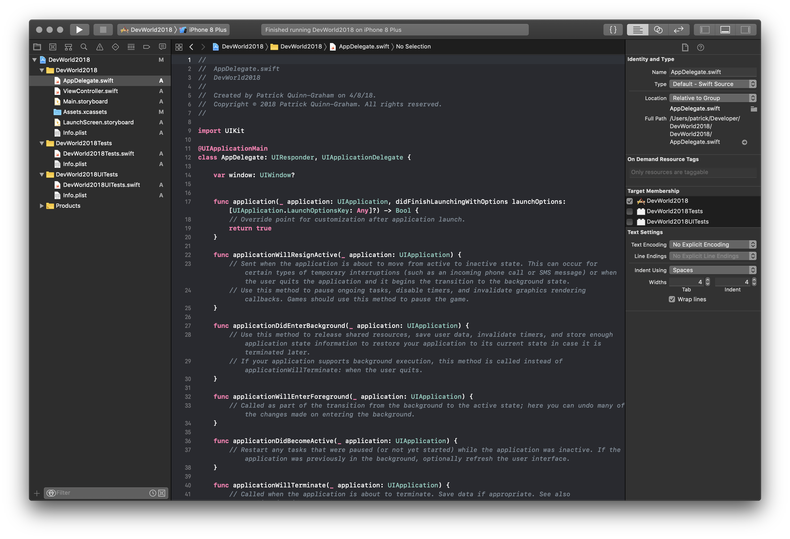
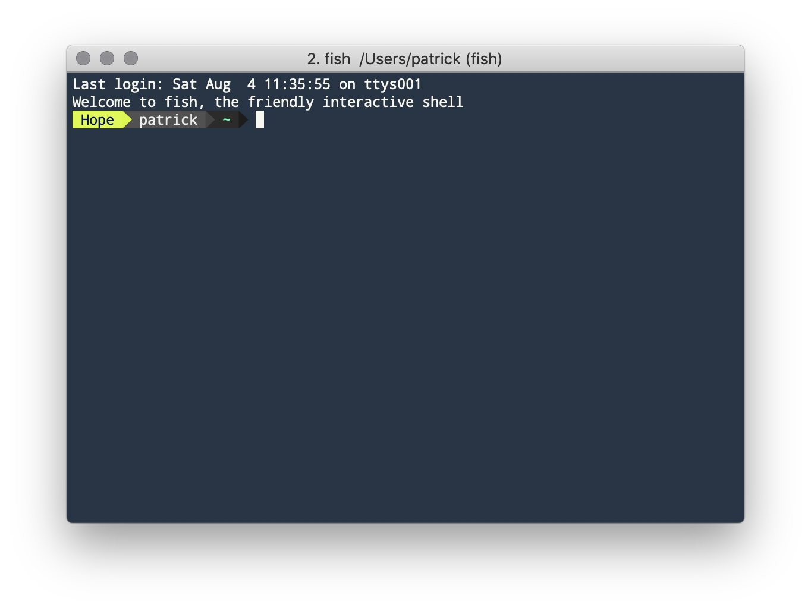
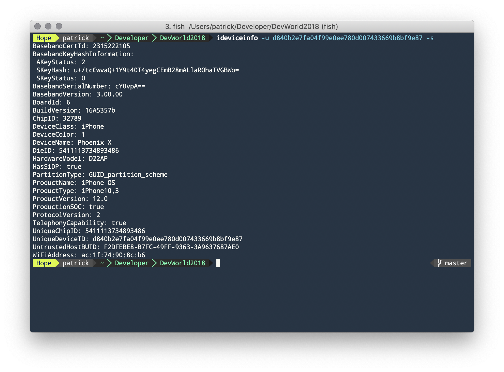
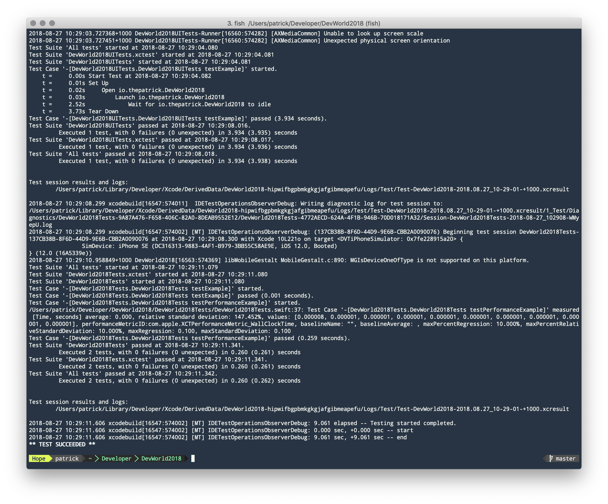
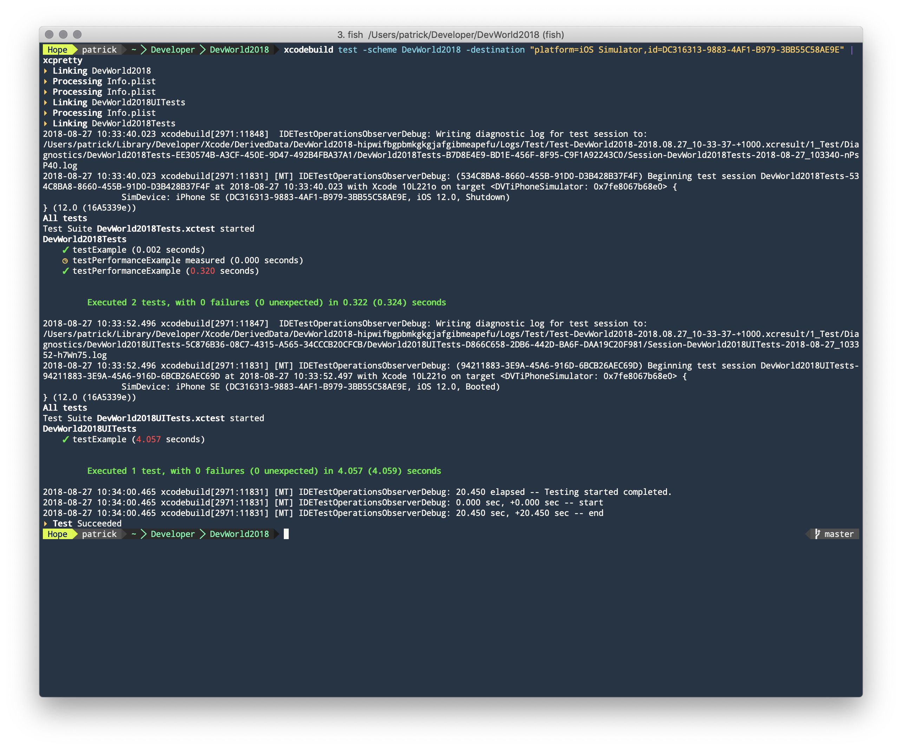

export { default as theme } from './theme'

import { FullCode, FullScreenCode, Invert, Split, SplitRight } from 'mdx-deck/layouts';

import { Image, Appear } from 'mdx-deck'

<Image src="DW18-TitleSlide.001.png" />
---
# About Me
## Patrick Quinn-Graham
### Staff Engineer, Tokbox/Vonage

```notes
Why hello there!

I'm Patrick Quinn-Graham, and I work in the DevOps team at Tokbox, a Vonage company. We make server software and client SDKs for the web, iOS, Android, Windows, Linux Android macOS.
```
---
# why are we here?

```notes
so, why are we here?

Hopefully not because you're in the wrong room.

Synthesizers are in the other room, and Compose is somewhere else in the building.
```
---


```notes
Ok, so this is probably a familiar sight. This year it's getting a little bit darker, but fundamentally Xcode is a macOS application - you go in, you type some things, you click some buttons and like magic a money making application falls out.
```
---



```notes
But we aren't here to talk about Xcode.

Ok we are, but not the GUI. We're going to talk about how to do as many of the things you might do in Xcode from the comfort of a terminal.
```
---
export default Invert

# 1. `xcodebuild`
```notes
Before we start: code or terminal commands will appear in a monospaced font like this. Terminal commands will show up with a #/hash as a "prompt".

The first ingredient is xcodebuild. What can you do with xcodebuild?
```
---
```bash
# xcodebuild
```
# build
## your app, framework, ...

```notes
Right! As it's name suggets, it lets you build. 

It builds using the xcode project (and workspace!) except from the command line. 
```
---
```bash
# xcodebuild test
```
# test
## ooh

```notes
We are all good and write tests and even remember to run them too right?

Last year I talked here at /dev/world about continuous integration, and xcodebuild test is the secret sauce for actually running your tests.

Note that I missed something here... where are those tests going to run?
```
---
```bash
# xcodebuild test \
-scheme SCHEME \
-destination DESTINATION
```

# test on device
## ooh-er!

```notes
Of course testing in the simulator is great. But testing on a device is...
better?

Now the destination argument lets you specify where your test will run.

How do you specify the device?
```
---
```bash
# xcodebuild test -scheme SCHEME 
  -destination platform=iOS,name=DEVICE_NAME

# xcodebuild test -scheme SCHEME 
  -destination platform=iOS,id=SOME_DEVICE_UUID

# xcodebuild test -scheme SCHEME 
  -destination platform=macOS,arch=x86_64
```

```notes
Destination takes 2-3 key value pairs. Platform is always required values you can expect to see include iOS, macOS, watchOS, tvOS.

For iOS devices you can either specify the name (as shown in the Xcode Device Library), or the UUID. In automated testing environments I tend to prefer the UUID... but how do you find that in an automated way? We'll come back to that.
```
---
```bash
# xcodebuild test -scheme SCHEME 
  -destination "platform=iOS Simulator,id=SIMULATOR_ID"

# xcodebuild test -scheme SCHEME 
  -destination "platform=iOS Simulator,name=iPhone SE,OS=12.0"
```

```notes
Oh look, thereI left off some platforms - you can also specify simulators this way too.

If you specify the name, you'll want to specify the OS version running in the simulator as well.

How do you get the simulator ID, or list of simulators? Stay tuned and we'll talk simctl in a few minutes.
```
---
# More Destinations

[Read this](http://www.mokacoding.com/blog/xcodebuild-destination-options/)

```notes
Grab the slides afterwards and click through to this post from Giovanni.

He's probably around here somewhere too.
```
---
```
# xcodebuild test ... -workspace WORKSPACE
```

# workspaces

```notes
There's a reasonable chance you use a workspace - CocoaPods requires it, but they're also pretty useful if you're using frameworks and the like.

In that case how do you tell xcodebuild to use your workspace? You've probably spotted the -workspace argument on this slide, and guessed that's how you do it. You'd be right!
```
---
```bash
# xcodebuild build-for-testing
# xcodebuild test-without-building
```
# test without building every time

```notes
Why? Depending on how you structure your CI - especially if you use a matrix in travis-ci or a pipeline in jenkins - building once and then running tests in parallel can really help improve your test time.
```
---
# More on xcodebuild

[Technical Note TN2339](https://developer.apple.com/library/archive/technotes/tn2339/_index.html#//apple_ref/doc/uid/DTS40014588-CH1-WHAT_KEYS_CAN_I_PASS_TO_THE_EXPORTOPTIONSPLIST_FLAG_)

```notes
Grab the slides afterwards and check out this tech note.
```
---
export default Invert

# 2. IPAs

```notes
It's everyone's favourite extension for a file that is actually a zip...
```
---
# make an ipa
## start with an archive
```bash
# xcodebuild archive -workspace WORKSPACE 
  -scheme SCHEME 
  -sdk iphoneos 
  -configuration AppStoreDistribution 
  -destination DESTINATION 
  -archivePath $PWD/build/archive.xcarchive
```

```notes
So start by building an archive.
```
---
# make an ipa
## then export
```bash
# xcodebuild -exportArchive 
  -archivePath $PWD/build/archive.xcarchive 
  -exportOptionsPlist exportOptions.plist 
  -exportPath $PWD/build
```

```notes
Then we export the archive. That options plist is...
```
---
# make an ipa
```plist
...
    <key>method</key>
    <string>app-store</string>
    <key>teamID</key>
    <string>YOUR_TEN_CHARACTER_TEAM_ID</string>
...
```

```notes
Is how we control whether we want a build for the app store or
enterprise distribution (ad-hoc). See xcodebuild -help for all
the keys.
```
---
# upload an ipa to App Store Connect
```bash
# xcrun altool --upload-app -f MyApp.ipa 
  -u MY_USERNAME -p MY_PASSWORD
```

```notes
And what do we do with that ipa? We upload it to App Store Connect
of course! The delightfully named "altool" is what we use. It's
buried deep inside the Xcode bundle, so rather than find the path
just use xcrun.
```
---
# xcrun
## Find and execute the named command line tool from the active developer directory.

```notes
To which I'll give an honourable mention to xcrun. From it's own
documentation it finds and executes the named command from the active
developer directory.
```
---
# xcode-select

Print the current Xcode:
```
# xcode-select -p
```

Set another:
```
# xcode-select --s /Path/To/Xcode.app/Contents/Developer
```


```notes
How do set the active developer directory? xcode-select!
```
---
export default Invert

# 3. simctl

```notes
Earlier I promised to the list of simulators available, and
now I'm going to make good on that. simctl is the tool that
lets you list, create, poke at, generally manage simulators.
```
---
# List things

Simulators

```
xcrun simctl list devices
```


```notes
Lists all simulators - filter by "Booted" and "Shutdown" to get the list of currently available simulators.

Want to make your own? We'll need a couple of things first...
```
---
# List things


Device types

```
xcrun simctl list devicetypes
```

```notes
These are the types of simulator you can create: iPhone X, iPhone 8, different watch sizes, Apple TVs etc.
```
---
# List things

Runtimes

```
xcrun simctl list runtimes
```

```notes
Think of a simulator runtime as an OS version.
```
---
# Create a simulator

```
# xcrun simctl create DevWorld
  com.apple.CoreSimulator.SimDeviceType.iPhone-X
  com.apple.CoreSimulator.SimRuntime.iOS-12-0
```

```notes
Creating a simulator requires 3 arguments - a name,
a device type, an a simulator run time, that basically
maps to an OS version.
```
---
# Get an app into your simulator

Install it
```
# xcrun simctl install SIMULATOR_ID /path/to/Your.app
```

And launch it
```
# xcrun simctl launch SIMULATOR_ID com.your.app
```

```notes
Now that we have a shiny new simulator, let's install an
app we built (using xcodebuild of course!) and then
launch it.
```
---
# Or open a URL

```
xcrun simctl openurl SIMULATOR_ID x-your-app://
```

```notes
If your app supports URL handlers, try them out using openurl. Also useful for loading web things in to the simulator's copy of Safari.
```
---
# More

[simctl: Control iOS Simulators from Command Line](https://medium.com/xcblog/simctl-control-ios-simulators-from-command-line-78b9006a20dc)

```notes
I'm starting to feel like you could do an entire talk on
simctl, but we have some other things to talk about.

Grab the slides afterwards and check out this medium post.
```
---
export default Invert

# 4. Patrick's weird tricks

```notes
Like anyone who has dealt with computers in ways that are a little outside of the usual end user / developer role, I've come across some edge cases. I'll share a couple here.
```
---
# running your app on a device?

```notes
What if you are doing something a little bit different. You just want to run an app on demand on an iOS device. You aren't doing a traditional xctest.
```
---
# not exactly
## but you can cheat

```notes
So a few years ago I needed to do exactly this!

I was building a testing framework that meant the iOS app was basically a shell that accepted remote commands.

Building an app is easy. Running it in the simulator isn't even that hard (at least today).
```
---
# spin the run loop!
```swift
func testRunner() {
    var dt = Date(timeIntervalSinceNow: 0.1)
    while true {
        RunLoop.current.run(mode: .default, before: dt)
        dt = Date(timeIntervalSinceNow: 0.1)
    }
}
```

```notes
My one weird trick is: run the run loop.

This test function blocks forever, except because it spins the run loop inside itself the main thread isn't actually blocked. Which means the app still gets to do its thing. Whatever that thing is.
```
---
# the what loop?

```notes
If you aren't familiar with the run loop: you don't need to be, but I suggest investigation - knowing about it and when you might want to mess with it can help you out a lot.
```
---
# Objective-C Macros

```
# xcodebuild build \
GCC_PREPROCESSOR_DEFINITIONS="MY_MACRO=@\\"AWESOME\\""
```

```
// and in objective-c:
-(void)awesomeFunction {
  NSLog(MY_MACRO);
}
```

```notes
My next weird trick is how to push some value in to your code on the fly. Really useful if you want to inject a dynamic value in, such as a tempory API endpoint URL.

You can get this in to Swift using a briding header just like you'd use for bringing in any other Objective-C to your nice clean Swift world.
```
---
# Swift Flags

```
# xcodebuild ... OTHER_SWIFT_FLAGS="-D’COOL_FLAG’"
```

```swift
// your swift code
...
#if COOL_FLAG
  print(“WE Are Cool”)
#endif
...
```

```notes
If you don't need to get a dynamic string in, then Swift flags might be a great way to toggle some behaviour.

Schemes & xcconfig files are a great way to handle different environments though.
```
---
# Code signing

```notes
It's everyone's favourite part of iOS & friends development.

Ok, maybe after app review.

We're now at the point where Xcode can do a lot for you, but what if you have something weird to contend with?
```
---
# Code signing: Custom team

```
# xcodebuild DEVELOPMENT_TEAM=...
```

```notes
If you work on a proprietary app then there's a good chance you configure the development team in Xcode, and let all the magic just... work.

But if you're working on something open source, or just an environment where your developers & CI might use different teams, then throw DEVELOPMENT_TEAM on the end to force a different one.
```
---
# Code signing: Custom keychain

```
xcodebuild --keychain $PATH_TO_KEYCHAIN
```

```notes
On your local machine Xcode probably (now) manages your certificates and everything is mostly smooth.

On your CI, especially if you are building a release, you probably want to be more in control of the keychain that holds your signing key.
```
---


```notes
Super easy to make - just open Keychain Access, pull down the File menu and click New Keychain.

You can then drag & drop certificates from another key chain, or from the Finder to add them to your new keychain.

You can now copy this around your CI servers. Much easier too when it comes to updating the certificate in a year's time.
```
---
## "Load" a keychain
```
# security -v list-keychain -s path/to/keychain
```

```notes
So now that you have a keychain, you need to tell macOS about it.

You might wonder why the command is "list-keychain", but I don't know why. It's weird.
```
---
## "Unlock" a keychain

```
# security -v unlock-keychain -p $PASSWORD path/to/keychain
```

```notes
When you created your keychain you gave it a password.

You need to unlock the keychain before you can use it. Keep in mind if you are running this in the shell that if you don't take precautions it'll end up in your history.

You can change the password later in Keychain Access too.
```
---
## Change how long before you need to unlock the keychain again

```
# security -v set-chain-settings -t $TIMEOUT -l path/to/keychain
```

```notes
Bonus tip: by default the keychain times out after a few minutes. If you have particularly nasty build times then you could easily find the keychain has automatically locked before it gets to signing your application at the end of the build.
```
---
export default Invert

# 5. libimobiledevice

www.libimobiledevice.org

```notes
Now we go off the beaten path entirely. Do not expect support from Apple for this.

lib i mobile device is a library & CLI tools that let you interact with iOS devices. It's great for Linux users as well, but it works pretty well on macOS.

You can get it from homebrew.
```
---
# List devices

```
# idevice_id -l
d840b2e7fa04f99e0ee780d007433669b8bf9e87
```

```notes
Gets you a list of iOS devices - in this variant just the UUID.
```
---
# Device info

```
# ideviceinfo -u $UUID -x -s
```

```notes
This will give you, in plist form, the device type, name, OS version...
```
---


```notes
Here it is non plist version.
```
---
export default Invert

# 6. Grab bag

```notes
To round things out here are some tools I find handy.

They're not as weird, and aren't tricks.
```
---
# xcpretty
```
# gem install xcpretty
```

https://github.com/supermarin/xcpretty

```notes
So what is xcpretty? It makes the output of xcodebuild...
pretty.
```
---


```notes
Here's xcodebuild test. If you have really good eyes you might be able to work out that the test passed. If you have really really good eyes you might even spot that there is both UI tests and unit tests.

Wouldn't it be better...
```
---


```notes
if it looked a bit like this? Here you can more easily see that we executed two unit tests, and then seperately we esxecuted 1 UI test.
```
---
# fastlane
## App automation done right

```notes
Fastlane have tools to help you take large numbers of screenshots, manage beta & app store releases, and...
```
---
# fastlane
## code signing
### certificates

```notes
I totally glossed over certificates. You will, especially if you automatic signing works for you in Xcode, probably be able to get away forgetting about certificates on your local computer. 
```
---
# fastlane
## code signing
### provisioning profiles

```notes
Like wise, provisioining profiles. It's well worth spending
some time here to make your own life a bit easier in a CI
setup.
```
---
export default Invert

# 7. Questions?

```
thepatrick.io/talks.html
```
---
export default Invert

# The end
